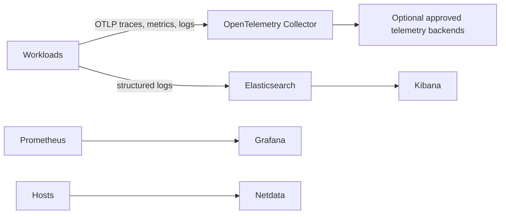

# Unified Observability Stack

A local, non-production observability lab that brings together **Grafana, Prometheus, Elasticsearch/Kibana, Netdata, and OpenTelemetry**. It also documents controlled integration paths for **SigNoz, Datadog, Splunk, and New Relic**.

> The repository deliberately separates runnable local components from SaaS integration guidance. Do not add SaaS tokens to Git. Use `.env.example` as the shape of local configuration and use a secret manager for real deployments.

## Architecture



## Run Locally

```bash
cp .env.example .env
docker compose config
docker compose up -d
```

See [`docs/LOCAL_VALIDATION.md`](docs/LOCAL_VALIDATION.md) for health checks, endpoints, and scope. The integration folders contain guidance for Datadog, New Relic, and Splunk; production use requires organisation-specific secrets, data-retention, access-control, and cost decisions.
